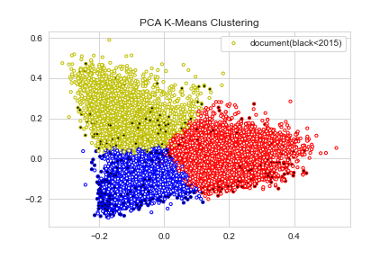

# Predicting Author Count

Does the writing quality, length, or style in groups of reseachers differ from how individual researchers write? 
Through my findings I was not able to disprove the null hypothesis. 
The baseline model I created chose the most prevelent class of over one researcher every time.
Through gradient boosting, naive bayes, random forest modeling, model manipulation(max_features etc.), and oversampling my models were unable to consistantly outpreform the baseline model. 

Quality of research writing is consistant and through not disproving my null hypothesis I have gained even more respect for paper writing accidemia, learning they have strong quality control and standards. 

Did the growth of AI research in acidemia create a noticable change in the lingo being used from 2015 on? 
Once again utilizing the previous modeling techneaks I was only able to outpreform the baseline model by .01 accuacy and therefor not reject the null hypothesis.

In my PCA analysis, words relating to which AI algorithm was being used where previelent:

TOP LEFT
image            0.471868
images           0.344713
cnn              0.152197
segmentation     0.130171
object           0.127900
network          0.118404
detection        0.111639
layer            0.106028
convolutional    0.106013
layers           0.101130

BOTTOM LEFT 
algorithm     -0.133055
xi            -0.091165
variables     -0.090568
theorem       -0.087040
let           -0.071364
function      -0.069414
graph         -0.067284
problem       -0.063979
probability   -0.063622
proof         -0.062341

BOTTOM RIGHT
image            0.471868
images           0.344713
cnn              0.152197
segmentation     0.130171
object           0.127900
network          0.118404
detection        0.111639
layer            0.106028
convolutional    0.106013
layers           0.101130

The next steps are determining the cluster 

https://andrewmourcos.github.io/blog/2019/06/06/PCA.html
